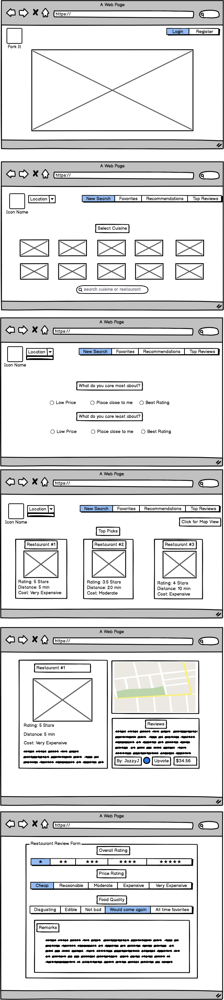

# Fork It
Restaurant Reviews with a clean U/I and incentivized reviews

### Overview
Yelp, Zomato, and other restaurant review applications have gotten too busy with their user design and functionality. Fork It provides a service that is more clean and less cluttered when searching for a restaurant whether that be for something close, inexpensive, or delicious. 

## User Story
- User navigates to application's homepage and must either register or login to account
- Once authenticated, user proceeds to homepage/dashboard
- From here, user can either search for a restaurant by selecting a cuisine, or type in a restaurants name or type a cuisine they want; Additionally, they must type in their location
- Once submitted, they will be asked what they care about most and least for their search parameters (i.e. Price, Distance, Ratings)
- Then they will be presented with the top 3 results of their search
- They can click on a specific restaurant that interests them and get more granular detail on the restaurant and its location. 

## Wireframes

## Database Schema

## Components
Home page
Login/register page
Index page (show all)
Display/edit/create page (show one)

## Priority Matrix/Build Step-by-Step (MVP/PostMVP) 

| Priority| MVP/Post-MVP | Component | Estimated Time | Time Invetsted | Actual Time |
| --- | --- | --- | :---: |  :---: | :---: | :---: |
| 1 | MVP | Rails UserTable/Controller | 1hrs| 0hrs | 0hrs |
| 2 | MVP | Rails ReviewTable/Controller | 1hrs | 0hrs  | 0hrs  |
| 3 | MVP | Connect Rails/React | 1hrs| 0hrs | 0hrs |
| 4 | MVP | React Landing Page/Navbar | 1hrs | 0hrs  | 0hrs  |
| 5 | MVP | React Homepage | 1hrs| 0hrs | 0hrs |
| 6 | MVP | Authorization | 5hrs | 0hrs  | 0hrs  |
| 7 | MVP | Connect Google Places API | 8hrs| 0hrs | 0hrs |
| 8 | MVP | Search function/React search results page | 4hrs | 0hrs  | 0hrs  |
| 9 | MVP | React Display One Restaurant | 2hrs | 0hrs  | 0hrs  |
| 10 | MVP | Create/Edit/Destroy Review | 8hrs| 0hrs | 0hrs |
| 11 | Post-MVP | Favorites/Your Reviews Page | 4hrs | 0hrs  | 0hrs  |
| 12 | Post-MVP | Search parameters | 4hrs | 0hrs  | 0hrs  |
| 13 | Post-MVP | Google Map API | 8hrs| 0hrs | 0hrs |
| 14 | Post-MVP | Monetize Reviews/Integrate SteemIt | 4hrs| 0hrs | 0hrs |
| 15 | Post-MVP | Recommendation Feature | 15hrs| 0hrs | 0hrs |
| Post-MPV | Estimate - 67hrs | MVP | Estimate - 32hrs| Invested 0hrs | Actual Total 0hrs |

### MVP
- User authentication and authorization
- Display all locations.
- Add, display, edit and delete locations
- Display individual location on Google map

### Post MVP

## Technologies Used
- Rails
- Devise (For authentication)
- React
- Flexbox

### APIs
- Google Places
- Google Maps 
- Zomato API

### Planning Helpers
- LucidChart
- Balsamiq

